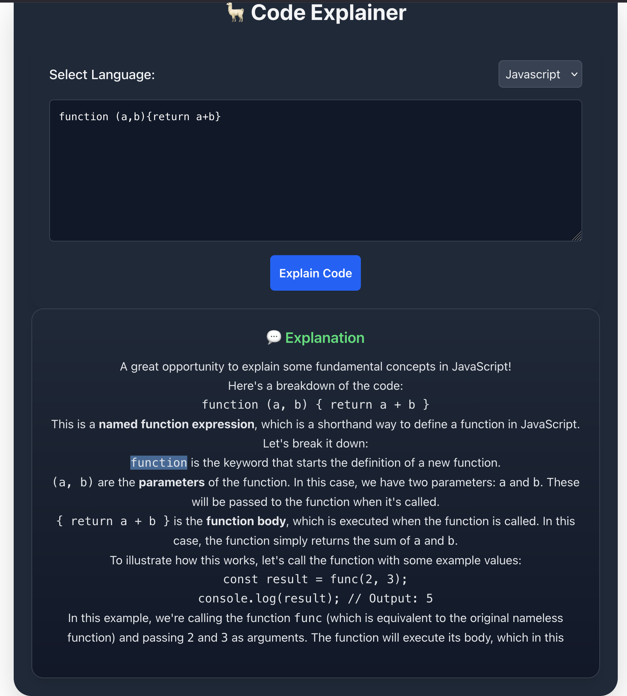
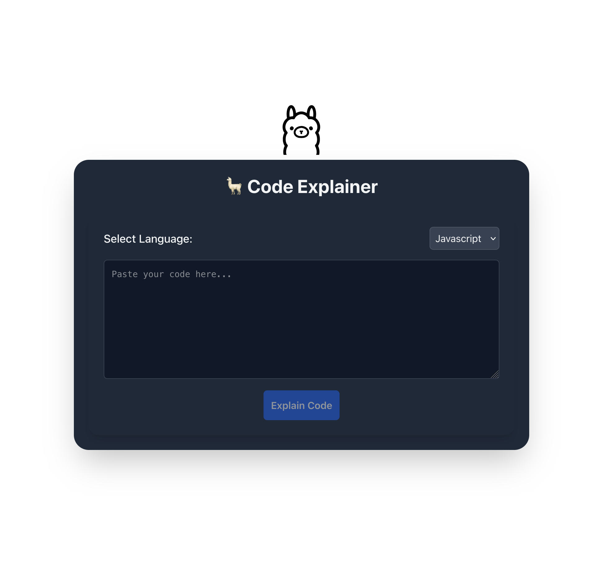

# 💡AI_Code_explainer_with_Ollama (UI)

A modern **React 19 + Vite** app that connects to an **Express + Ollama backend** to explain code in plain English.  
Paste any code snippet, select a language, and get a streaming AI-powered explanation in real time.

---

## 🚀 Tech Stack

- ⚛️ **React 19** — latest React with concurrent rendering support  
- ⚡ **Vite** — lightning-fast dev server and build tool  
- 🎨 **Tailwind CSS** (via `@tailwindcss/vite`) — utility-first modern styling  
- 💬 **React Markdown** — clean Markdown rendering for AI responses  
- 🔗 **Fetch Streaming API** — real-time NDJSON response from backend  
- 🤖 **Ollama (Llama3)** — local AI model that generates explanations

---

## 📁 Project Structure

```bash
code_explain_UI/
├── src/
│ ├── assets/
│ ├── components/             # Shared presentational components
│ │ ├── CodeExplainer.jsx            # Code input editor
│ │ ├── LanguageSelector.jsx  # Language dropdown
│ │ ├── Explanation.jsx       # Streaming AI output renderer
│ │ └── Button.jsx            # Reusable button
│ ├── App.jsx                 # Main React component (UI+logic)
│ ├── main.jsx # Entry point
│ ├── index.css # Tailwind import
├──  .gitignore
├── index.html
├── package.json
├── vite.config.js # Vite + Tailwind plugin config
└── README.md
frontend/
```
---

## Screenshot



---

## ⚙️ Setup Instructions For OllAMA_APP 

### Prerequisites

Make sure you have installed:

- Node.js **v18+**
- Ollama running locally  
  (with `llama3` model downloaded: `ollama pull llama3`)
- Backend API running - inside server `npm run dev`

---

### Create a New Vite Project

```bash
- npm create vite@latest app-name
```

### Install Dependencies
- Backend API running - inside backend `npm run dev`
`npm install @tailwindcss/vite react-markdown``


### Run the App

`npm run dev`

### Tailwind Setup
This project uses the new Tailwind Vite plugin (no PostCSS config needed).

✅ vite.config.js

```bash
export default defineConfig({
  plugins: [react(), tailwindcss()],
});
```

✅ src/index.css

`@import "tailwindcss";`

🧠 How It Works

User pastes code and selects a language

Frontend sends a POST request to backend /api/explain-code

Backend streams AI tokens (NDJSON format) from Ollama

Frontend reads the stream with ReadableStream, updates UI live

Markdown explanations render instantly with smooth scrolling

🧭 Quick Start Summary

```bash

git clone <repo>
cd frontend
npm install
npm run dev

```

res.body = a pipe that the words flow through

getReader() = your hand catching each word chunk

TextDecoder() = your translator converting binary data into text